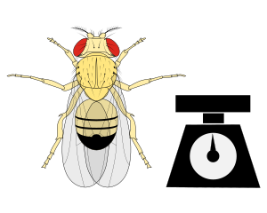
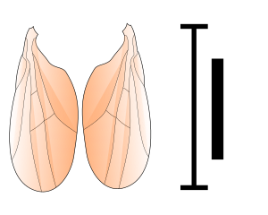
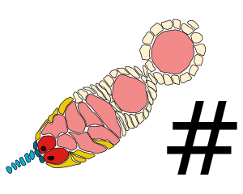
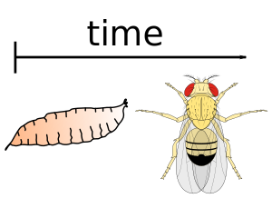
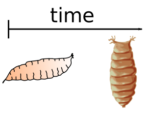

# The transgenerational effect of nutrition on flies.

Research design and data collection by **Joe Deas**1; Data-visualization by **Leo Blondel**1;
Principal Investigator **Cassandra G Extavour**1

*1: Department of Organism and Evolution, Harvard University.*

## Abstract

*Abstract of the paper goes here.*

## Data visualization

 This is an interactive data visualization that allows the user to explore interactively the dataset published in the paper **ADD REF TO PAPER ONCE PUBLISHED**.
 Represented on the left matrix are the results of corrected pairwise statistical comparisons between two sets of generations, each having been subjected to a different diet.
 To explore this dataset, you can observe on the matrix the significance of a change of diet in a given phenotype. On the right size, you will find different filters and selectors change the phenotype, or ask particular hypothesis.
 For example, you can choose to observe the difference for a Rich F0 diet, followed by a Poor F1 diet, by selecting **Generation Selector: F0 Rich F1 Poor F2 Any**.
 To observe the raw data behind a particular comnparison, click on the corresponding square in the matrix, and the raw data will be displayed under *Raw data vizualisation for a given comparison*.

## Raw data

The raw data can be downloaded here: <a href="./dataset/dataset.zip">Dataset</a>. The documentation is in the <a href="https://github.com/extavourlab/TransgenerationalEffectOfNutrition/tree/master/dataset">README.md</a> file. The source code for this dataviz is Open-Sourced under the MIT licence, and can be found here: <a href="https://github.com/extavourlab/TransgenerationalEffectOfNutrition">Github Repository</a>.

## Legend

**P**: Poor; **R**: Rich; **S**: Standard 
**XY**: F0 was subjected to diet X and F1 diet Y (example: PR: F0 poor and F1 rich) 
**XYZ**: F0 was subjected to diet X, F1 diet Y and F2 diet Z (example: SRP: F0 standard, F1 rich and F2 poor)

     Egg Size
     Fly mass
     Wing Length
     Number of Ovariole
     Larvae to Adult development time
     Pupae to Adult development time
     Larvae to Pupae development time

  

  

  

  

  

  

    Each square is colored by the p-value of the statistical test performed between the corresponding column and row group. The p-value is displayed by hovering over the square. The darker the blue, the more significant the difference is.
  

